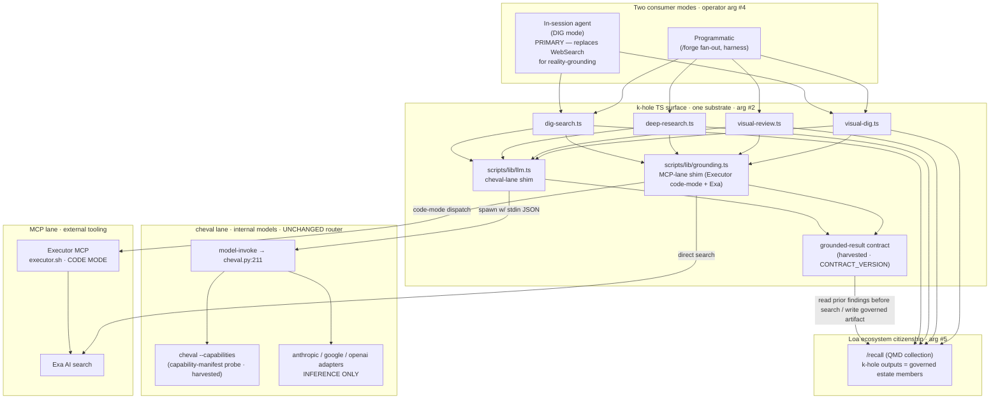
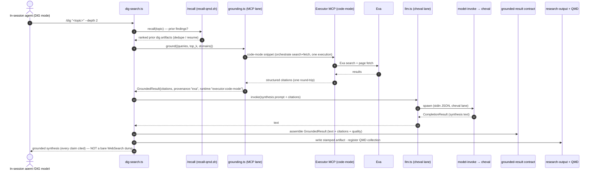
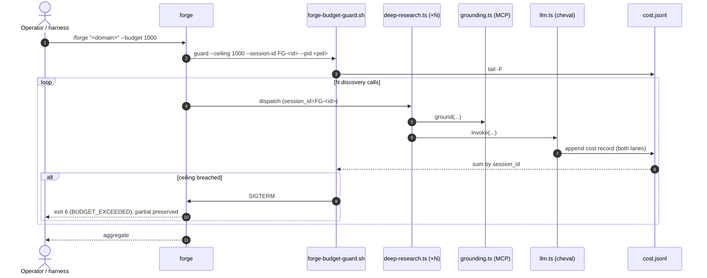

<!--
provenance: Phase 2 of issue 0xHoneyJar/construct-k-hole#21 (dig-search Effect-TS rebuild).
Phase 1 (streaming/scout/escape-hatch/envelope-loop) shipped via PRs #22/#25/#26 — archived at
grimoires/loa/archive/2026-07-06-dig-search-phase1-shipped/. This SDD is the "separate kickoff =
Phase 2/2.5/3 — the Effect-TS substrate rebuild" that Phase 1's PRD deferred, now sharpened by the
operator's two-lane mental model (2026-07-06): cheval = internal models, MCP (Exa/Executor) =
external tooling, harmonized by the harvested grounded-result contract.
Authored in a bonfire session, cd-bridged to construct-k-hole (same pattern as the Phase 1 PRD).
Supersedes the April sdd-khole-hounfour.md (OpenRouter design). See grounding facts:
bonfire/grimoires/loa/context/khole-redesign-grounding-facts-2026-07-06.md
-->

---
operator_signed: false
read_state: unread
use_label: use_as_background_only
trust_tier: ai-derived
confidence: 0.3
decay_class: working
privacy_scope: actor_private
provenance:
  source_type: model_output
floor_stamped: 2026-07-06
---

# Software Design Document — k-hole Redesign: Two Lanes, One Grounded-Result Contract

**Version:** 2.0 (redesign — supersedes the OpenRouter migration)
**Date:** 2026-07-06
**Author:** Architecture Designer (via /architect · designing-architecture)
**Status:** Draft — ready for `/flatline-review` → `/sprint-plan`
**Supersedes:** `grimoires/loa/sdd-khole-hounfour.md` v1.2 (2026-04-18, OpenRouter-provider migration). That SDD's central bet — OpenRouter `:online` as the primary transport — is **retired by operator directive** (arguments #1, #3, 2026-07-06). The parts that survive (shell-out shim, versioned error contract, snapshot/parity testing, cost log) are carried forward below with citation.
**Requirement source of record:** `grimoires/loa/context/user-description.md` (operator mental model, BINDING) + `grimoires/loa/context/khole-redesign-grounding-facts-2026-07-06.md` (cite-checked live-repo facts) + operator arguments (this session). The stale ordering-scale `prd.md` and the April `prd-khole-hounfour.md` are **not** the requirement source for this redesign.
**Upstream target:** `github.com/0xHoneyJar/construct-k-hole` (PR after implementation gate)

> **Framing.** This is a re-wiring, not a rewrite. The stack exists (`loa_cheval` / `model-invoke`, the k-hole TS scripts, Executor MCP, Exa). The redesign's job is to stop *transport-swapping* — the flakiness failure mode where k-hole cycled Gemini-direct → OpenRouter `:online` → Executor, each swap a script-surgery churn — and replace it with a **stable combination of two lanes emitting into one contract**. Per the operator: *"Design for the combination, not the next swap"* (user-description.md:8).

---

## Table of Contents

1. [Project Architecture](#1-project-architecture)
2. [Software Stack](#2-software-stack)
3. [Data Contracts & State](#3-data-contracts--state)
4. [UI Design](#4-ui-design)
5. [API Specifications](#5-api-specifications)
6. [Error Handling Strategy](#6-error-handling-strategy)
7. [Testing Strategy](#7-testing-strategy)
8. [Development Phases](#8-development-phases)
9. [Known Risks & Mitigation](#9-known-risks--mitigation)
10. [Open Questions](#10-open-questions)
11. [Appendix](#11-appendix)

---

## 1. Project Architecture

### 1.1 System Overview

k-hole is the operator's DIG-mode research construct (`/dig`, `/forge`, `/visual-review`, `/visual-dig`) — the mandated research path per kernel doctrine ("web research via k-hole `dig-search.ts`, NEVER Agent+WebSearch as substitute"). Today its four TypeScript scripts each hand-roll their own transport and bypass the shared router entirely:

- `dig-search.ts` carries **two** live transports — a direct Gemini client (`generativelanguage.googleapis.com`, line 388) *and* an OpenRouter `:online` client (`openrouter.ai/api/v1`, line 563; `toOpenRouterModel(...):online` at line 548) — plus a Gemini-CLI fallback (`geminiCliCall`, line 776). Provider is chosen at runtime by which key is present (`USE_OPENROUTER`, line 161). Verified 2026-07-06.
- `deep-research.ts` (line 369), `visual-review.ts` (line 278), `visual-dig.ts` (line 49) each hand-roll a direct Gemini client. `deep-research.ts` contains a ~180-line duplicate of the Gemini client (grounding-facts:8).
- `construct.yaml` declares `capabilities.requires.tool_calling: true` but **not** `grounded_search` — the actual dependency (construct.yaml:100-103; grounding-facts:9).

k-hole is the **only** member of the Loa+bonfire estate that bypasses `model-invoke`/cheval (grounding-facts:8). A prior fix branch (`0xHoneyJar/loa @ feat/khole-hounfour-framework`, tip `1c123a16`) stranded unmerged for 11 weeks; nothing on main replaced it (grounding-facts:16).

**The redesign** rewires all four scripts onto a stable two-lane substrate, both lanes normalizing into a single harvested **grounded-result contract**. OpenRouter is removed. The two lanes are:

| Lane | Role | Transport | Owns |
|------|------|-----------|------|
| **cheval lane** | Internal-model dispatch (reasoning, synthesis, vision) | `model-invoke` → `cheval.py` → provider adapters | All LLM inference. "cheval stays; it is not being replaced" (user-description.md:5). |
| **MCP lane** | External-tooling dispatch (live web grounding, retrieval) | Executor MCP (**code-mode**) + Exa AI search | All external-world grounding. "Executor operates similarly to cheval… a dispatch pipe, but for external tools, not internal models" (user-description.md:6). |

Deep research is the **combination** of both — cheval reasons, the MCP lane grounds, both emit `GroundedResult`. The contract, not a transport, is the stable seam (user-description.md:7-8; grounding-facts:33).

### 1.2 Architectural Pattern

**Pattern:** Two dispatch lanes behind a single anti-corruption contract (the grounded-result contract as the harmonizing layer), consumed via a thin shell-out/MCP shim from the k-hole TS surface.

**Justification (three load-bearing operator decisions, 2026-07-06):**

1. **cheval = internal models; MCP = external tooling (two lanes, both kept).** The prior design tried to make *one* pipe (OpenRouter `:online`) carry both inference and grounded search. That coupling is what forced transport-swapping every time grounding quality or credits moved. Separating the concerns lets each lane change independently *behind the contract* without script surgery (user-description.md:5-8; grounding-facts:33 decision 1).
2. **Executor code-mode over per-tool MCP calls (flakiness cure).** *"External access will ride through Executor MCP. Code mode is the path forward to prevent flakiness"* (operator arg #1). Instead of many individual MCP tool round-trips (each a failure point mid-research), the MCP lane hands Executor a single code snippet that orchestrates the external calls in one sandboxed execution and returns one structured result. Fewer round-trips → fewer partial-failure states. Executor MCP is configured live: `https://executor.sh/soju-s-organization/mcp` (~/.claude.json, verified; grounding-facts:11).
3. **One substrate for all four scripts.** *"All four scripts on the same substrate so things don't break"* (operator arg #2). `dig-search.ts`, `deep-research.ts`, `visual-review.ts`, `visual-dig.ts` all route through `scripts/lib/llm.ts` (cheval lane) and `scripts/lib/grounding.ts` (MCP lane). No per-script transport clients survive. This deletes the duplicate Gemini clients (deep-research.ts ~180 LoC) and both OpenRouter and Gemini-CLI paths from dig-search.ts.

**Carried forward from the April SDD (still correct):**
- Shell-out (TS → Python `model-invoke`) rather than a full Python port — k-hole's TS voice/synthesis/`--trail` tooling is load-bearing and the *feel* is the product (sdd-khole-hounfour.md:76-80; DECISION-2).
- Versioned JSON error contract (§6), snapshot/parity testing (§7), cost log (§3.6).

**Explicitly retired from the April SDD:**
- `hounfour.providers.openrouter` as a k-hole transport (the `:online` Exa-via-OpenRouter path). The Exa grounding OpenRouter was proxying moves to the MCP lane as **first-class Exa** (direct MCP or via Executor code-mode), not a proxied web-plugin.
- The `google_search` / `exa` provenance dichotomy framed as *provider* choice. Provenance is now *lane* choice, and both are legitimate simultaneous inputs to one synthesis.

> **DO NOT PORT** the OpenRouter `:online` / Google adapter parse from the stranded branch commit `55861347` — it is transport-specific and duplicates dig-search.ts, exactly the swap-lane being exited (grounding-facts:24).

### 1.3 Component Diagram



### 1.4 System Components

#### Component A: grounded-result contract (harvested · the harmonizing layer)

- **Purpose:** The single transport-agnostic shape both lanes emit into. This is *the* architectural keystone — it is what makes "stop swapping transports" mechanically true. Harvest from the stranded branch rather than re-derive (grounding-facts:18-23).
- **Harvest sources** (transport-agnostic; port as-is with adaptation to the two-lane model):
  - `ce555e2b` — `GroundedResult` / `Citation` / `GroundedQuality` dataclasses.
  - `66c2fcd7` — JSON schemas: `grounded-result-v1`, `error-v1`, `request-v1`, `openrouter-response-v1` (drop/rename the last — it is transport-specific to a removed provider).
  - `c330c7b9` — `CONTRACT_VERSION` + `cheval --capabilities` manifest (sprint-1 flags: `grounded_result: true`; `failover_chain`/`cost_log`/`governance_enforcement: false`).
  - `1c123a16` — `test_grounded_result.py` (301 lines) + `test_error_contract.py` (155 lines) + 12 error fixtures.
- **Responsibilities:** Data carrier + version stamp only. No transport logic. Lives in `loa_cheval` (Python source of truth) with a field-for-field TS mirror in `scripts/lib/` for the k-hole surface.
- **Interfaces:** Both `llm.ts` (cheval lane) and `grounding.ts` (MCP lane) return `GroundedResult`. See §3.1 for the full shape.

#### Component B: `scripts/lib/llm.ts` — cheval-lane shim (new)

- **Purpose:** Single entry for all k-hole **inference** calls. Replaces the per-script Gemini/OpenRouter/Gemini-CLI clients in all four scripts.
- **Responsibilities:** serialize request → spawn `model-invoke` (`child_process.spawn`, stdin JSON, never argv content) → parse stdout into `GroundedResult`/`CompletionResult` → typed errors on non-zero exit → client-side ≤10 MB payload guard → secret redaction → soft-fail with install message if `model-invoke` absent (standalone-repo resilience). (Transport, guards, and error mapping carried forward from sdd-khole-hounfour.md:142-159.)
- **Consumes the capability manifest:** before dispatch, probes `cheval --capabilities` (harvested `c330c7b9`). construct-k-hole already ships a `claude-headless-shim` override that probes `cheval --capabilities` and falls back when missing — the consumer side of this contract already exists (grounding-facts:10). `llm.ts` reuses that pattern rather than inventing a new probe.

#### Component C: `scripts/lib/grounding.ts` — MCP-lane shim (new)

- **Purpose:** Single entry for all k-hole **external-world grounding**. This is the lane that used to be OpenRouter `:online`; it is now Executor code-mode + Exa.
- **Responsibilities:**
  - Compose an Executor **code-mode** snippet that runs the search/fetch plan (queries, top-k, domain filters) in one sandboxed execution and returns a structured citation set — one round-trip, not N flaky tool calls (operator arg #1).
  - Direct-Exa path as the simpler fallback when a single search suffices (no orchestration needed).
  - Normalize whatever the lane returns (Exa results, page fetches) into `Citation[]` + `GroundedResult` with `grounding_provenance = "exa"` / `grounded_runtime = "executor:code-mode"` or `"exa:direct"`.
- **Interfaces:** `ground(opts): Promise<GroundedResult>`; consumed by `dig-search.ts` (grounded `/dig`), `deep-research.ts` (`/forge` discovery), `visual-dig.ts` (vision + grounding combined).
- **Dependencies:** Executor MCP endpoint (live, verified); Exa access. Soft-fails to `GROUNDING_UNAVAILABLE` (not silent non-grounded output) when the lane is unreachable — same fail-closed-on-`/dig` discipline as §3.4.

#### Component D: cheval adapters — inference only (unchanged transport, scope narrowed)

- The existing `anthropic_adapter.py` / `google_adapter.py` / `openai_adapter.py` remain for **inference**. The redesign removes the expectation that any adapter carries grounded *search* transport. Google's native grounded-search parse (formerly the k-hole `dig-search.ts:261-287` hand-parse) is **not** the primary grounding source anymore — the MCP lane is. If a native-Google grounded call is still wanted for a specific model, it stays available through the cheval lane but is a secondary provenance, not the default.

#### Component E: cost log + budget guard (FR-7a · carried forward)

- Unchanged from sdd-khole-hounfour.md:192-206 / §3.5: `model-invoke` appends per-call cost to `.run/model-invoke-cost.jsonl` (`O_APPEND`, `session_id`-tagged); `forge-budget-guard.sh` tails + sums + `SIGTERM` on ceiling breach with partial results preserved. Now spans **both** lanes — a `/forge` run's cost is cheval-inference + MCP-lane tool cost, both logged with a `lane` field.

#### Component F: /recall citizenship surface (new · operator arg #5)

- **Purpose:** Make k-hole a first-class Loa-ecosystem construct: its research outputs become governed estate members that `/recall` can retrieve and trust-weight, and k-hole grounds itself in prior findings before it searches.
- **Responsibilities:**
  - **Write side:** every research artifact (`grimoires/k-hole/research-output/*.md`) is stamped with Straylight frontmatter (`source_type`, `use_label`, `trust_tier`, `confidence`, `provenance`) via `recall-stamp.sh` and registered as a QMD collection so `recall-qmd.sh` indexes it (backend: `~/.claude/scripts/straylight-estate/recall-qmd.sh`, `qmd-sync.sh`).
  - **Read side:** at descent start, k-hole calls the recall route over the topic intent (`recall-qmd.sh "<topic>" --mode search`) to surface prior dig findings — dedupe, resume threads, avoid re-grounding what is already known. This is the construct-level analogue of the operator's `/recall` reflex.
  - **Provenance flows through the contract:** `GroundedResult` carries the fields recall governance trust-weights on (`retrieved_at`, `grounding_provenance`, citation authority), so a dig artifact enters the estate already legible to the governance plane.

### 1.5 Data Flow

#### Flow 1: In-session `/dig` (PRIMARY consumer · replaces WebSearch)

Per operator arg #4: *"In session may be most used in place of websearch because grounding Agent in reality is crucially important."* This is the highest-traffic path.



#### Flow 2: `/forge` discovery (programmatic fan-out, both lanes, budget-guarded)



### 1.6 External Integrations

| Service | Lane | Purpose | API Type | Notes |
|---------|------|---------|----------|-------|
| `model-invoke` / cheval | cheval | Internal-model inference (synthesis, vision) | Subprocess (stdin/stdout JSON) | `.loa/.claude/adapters/cheval.py:211`; unchanged router |
| Executor MCP | MCP | External-tool orchestration via **code mode** | MCP (`executor.sh/soju-s-organization/mcp`) | Live in ~/.claude.json; code-mode = one sandboxed execution, not per-tool round-trips |
| Exa AI | MCP | Live web search + retrieval (grounding source) | MCP / HTTP | Replaces the Exa-via-OpenRouter `:online` proxy — now first-class |
| `/recall` (QMD) | ecosystem | Prior-findings retrieval + governed-artifact indexing | Shell (`recall-qmd.sh`) | Makes k-hole a first-class estate citizen (arg #5) |
| ~~OpenRouter~~ | — | **REMOVED** (arg #3) | — | `hounfour.providers.openrouter` and all `:online` code deleted |
| Google Gemini direct | cheval (secondary) | Optional native grounded-search provenance | HTTPS REST | Retained only as a secondary cheval-lane inference/grounding option; no longer a bypass client in k-hole scripts |

### 1.7 Deployment Architecture

**Upstream `0xHoneyJar/construct-k-hole` (PR after implementation gate — do NOT edit `~/.loa/constructs/packs/k-hole/` in place; shared pack via symlink, arch-brief:157):**
- `scripts/lib/llm.ts` — new (cheval-lane shim)
- `scripts/lib/grounding.ts` — new (MCP-lane shim)
- `scripts/lib/grounded-result.ts` — new (TS mirror of the harvested contract)
- `scripts/dig-search.ts` — remove OpenRouter (`toOpenRouterModel`/`openrouterCall`, lines ~529-716; `USE_OPENROUTER`, line 161) + Gemini-direct (`geminiCall`, line 388) + Gemini-CLI paths; route via the two shims
- `scripts/deep-research.ts` — delete duplicate Gemini client (~180 LoC, line 369); route via shims
- `scripts/visual-review.ts` — remove Gemini-direct (line 278); cheval-lane vision
- `scripts/visual-dig.ts` — remove Gemini-direct (line 49); cheval-lane vision + MCP-lane grounding
- `construct.yaml` — version bump; `capabilities.requires.grounded_search: true`, `vision: true`; declare MCP-lane + cheval-lane dependencies (see §2.5)
- `scripts/tests/fixtures/` + `scripts/tests/diff-fixtures.ts` — new (parity, §7)
- `CHANGELOG.md` — redesign entry

**Framework-side (`loa_cheval`, via `.loa/` submodule — write requires explicit cycle-level approval per zone-system rule):**
- Harvest the grounded-result contract + schemas + `CONTRACT_VERSION` + `cheval --capabilities` manifest + test corpus from the stranded branch (Component A).
- Cost-log `lane` field (cheval | mcp) in the append path.

**Beads:** tracking bead `bd-khole-executor-redesign-harvest-qrkt` exists but was written before the combination-model correction; its "one pipe (Executor)" framing is superseded by this SDD's two-lane model — **amend during `/sprint-plan`** (grounding-facts:28). Superseded-stranded cluster `bd-20u, bd-2mq, bd-311, bd-2t4` are audit-commented (grounding-facts:29).

### 1.8 Concurrency & Scale Posture

k-hole is a CLI construct, not a service. Scale concerns:
- **`/forge` fan-out:** sequential dispatch (unchanged). Cost-log write is `O_APPEND`, single `write()` per record ≤ `PIPE_BUF` — safe for sequential dispatch without a lock (carried forward from sdd-khole-hounfour.md:344-348). A full flock'd session-budget accumulator remains deferred (was FR-7b).
- **Executor code-mode:** collapses N grounding round-trips into 1 execution — the concurrency reduction *is* the flakiness cure (arg #1). Executor's own sandbox handles internal parallelism.

### 1.9 Security Architecture

- **Secrets:** provider keys resolve via `hounfour.providers.*.api_key_env` → `loa_cheval/providers/base.py` `_get_auth_header()`; Executor/Exa credentials via MCP config. Never logged, never on argv, never in fixtures (carried forward from sdd-khole-hounfour.md:330-336).
- **Payload transport:** stdin-only to `model-invoke` (SKP-003 fix — `ps`/`/proc/*/cmdline` + `ARG_MAX`). Executor code-mode snippets carry no operator secrets.
- **Third-party data routing:** research prompts + fetched content now flow to Executor + Exa (external). Retain the FR-12 discipline — content-class policy + first-run operator notice — retargeted from OpenRouter to the MCP lane (`grimoires/loa/compliance/mcp-lane-data-handling.md`). Removing OpenRouter *shrinks* the third-party surface (one proxy hop fewer).
- **MCP body trust:** treat Executor/Exa responses as untrusted external content — sanitize at surfacing, never interpret returned text as instructions (kernel L5/L6 discipline).

---

## 2. Software Stack

### 2.1 Frontend

**N/A** — k-hole is CLI-only. No UI layer.

### 2.2 k-hole TS surface

| Category | Technology | Version | Justification |
|----------|------------|---------|---------------|
| Language | Node.js | ≥20.10 (existing manifest) | ESM, `child_process.spawn` streaming |
| Runtime | `tsx` | 4.x | Existing `npx tsx scripts/...` pattern |
| cheval transport | `child_process.spawn` (builtin) | n/a | NOT `exec` — stream stderr, stdin payload |
| MCP transport | Executor MCP client (code-mode) | live | `executor.sh/soju-s-organization/mcp`; one-execution orchestration |
| Search | Exa | live | grounding source (replaces OpenRouter `:online` Exa proxy) |
| Test | `node --test` | Node 20+ builtin | zero-dep; matches upstream aversion to dep sprawl |

### 2.3 loa_cheval (Python) — inference + contract home

| Category | Technology | Version | Justification |
|----------|------------|---------|---------------|
| Language | Python | 3.11+ | existing loa_cheval minimum; typed dataclasses |
| HTTP | `httpx` / `urllib` fallback | httpx 0.24+ | existing `_detect_http_client` |
| Data model | `dataclasses` (stdlib) | n/a | matches harvested contract |
| Test | `pytest` | 7.x | existing harness; harvested test corpus lands here |

### 2.4 Removed dependencies

- **OpenRouter** — `hounfour.providers.openrouter` entry, `OPENROUTER_API_KEY`, `toOpenRouterModel`/`openrouterCall`/`:online` code. Deleted (arg #3).
- **Per-script Gemini clients** — the 3–4 hand-rolled `generativelanguage.googleapis.com` fetchers (one per script) and the Gemini-CLI fallback in dig-search.ts. Collapsed into the cheval lane.

### 2.5 construct.yaml capability declaration (redesigned)

The manifest must declare what k-hole actually depends on so the ecosystem (and `sense-runtime-fit`) can verify capability-reality coherence (grounding-facts:9):

```yaml
capabilities:
  model_tier: opus            # unchanged (reasoning-heavy synthesis)
  downgrade_allowed: false    # unchanged
  requires:
    tool_calling: true
    thinking_traces: true
    vision: true              # was false — visual-review/visual-dig
    grounded_search: true     # NEW — the actual dependency, previously undeclared
  lanes:                      # NEW — declares the two-lane substrate
    cheval: { role: inference }
    mcp:    { role: grounding, providers: [executor, exa] }
```

---

## 3. Data Contracts & State

### 3.1 grounded-result contract (harvested + two-lane adaptation)

Harvest the dataclasses from `ce555e2b` and schemas from `66c2fcd7`; adapt `grounding_provenance` and add `grounded_runtime`/`lane` to reflect the two-lane model. The April SDD's extensibility work (SKP-005: `GroundedQuality`, `extra` escape hatches, coverage/reachability) is compatible and carried forward (sdd-khole-hounfour.md:407-494).

```python
from dataclasses import dataclass, field
from typing import Any, Literal, Optional

CONTRACT_VERSION = "2.0"   # harvested c330c7b9, bumped for two-lane model

GroundingProvenance = Literal["exa", "executor", "google_search", "none"]
Lane = Literal["cheval", "mcp"]

@dataclass
class Citation:
    title: str
    url: str
    snippet: str
    publisher: Optional[str] = None
    snippet_chars: int = 0
    rank: Optional[int] = None
    extra: dict[str, Any] = field(default_factory=dict)

@dataclass
class GroundedQuality:
    citation_count: int
    executed_query_count: int
    text_chars: int
    citation_urls_parseable: bool
    citation_urls_unique: bool
    coverage_estimate: float                       # 0.0–1.0; floor 0.3 for usable /dig
    reachability_checked: bool = False
    reachability_reachable_ratio: Optional[float] = None

@dataclass
class GroundedResult:
    text: str
    citations: list[Citation]
    executed_queries: list[str]
    grounding_provenance: GroundingProvenance
    grounded_runtime: str          # "executor:code-mode" | "exa:direct" | "gemini:native" | "none"
    lane: Lane                      # which lane produced the grounding
    retrieved_at: str               # ISO 8601 UTC — feeds /recall trust-weighting
    latency_ms: int
    quality: GroundedQuality
    contract_version: str = CONTRACT_VERSION
    extra: dict[str, Any] = field(default_factory=dict)
```

**Quality assertions (shim/tests enforce):** `citation_urls_parseable`; `coverage_estimate ≥ 0.3` for usable `/dig`; `citation_count ≥ 1` when `grounding_provenance != "none"` (else `GROUNDING_EMPTY`, §3.4). Carried forward from sdd-khole-hounfour.md:483-488.

**TS mirror:** `scripts/lib/grounded-result.ts` matches field-for-field; both `llm.ts` and `grounding.ts` return it.

### 3.2 Request contract (harvested `request-v1`)

Both shims serialize a request body to their lane. Carried-forward stdin transport (never argv content):

```json
{
  "contract_version": "2.0",
  "intent": "CRT phosphor decay as memory metaphor",
  "lane": "mcp",
  "grounding": { "queries": ["..."], "top_k": 8, "domains": [], "runtime": "executor:code-mode" },
  "inference": { "agent": "k-hole-dig", "model": null, "tools": ["vision"] },
  "session_id": "dig-20260706T1427-CRT-phosphor",
  "metadata": { "trail_ids": [], "caller": "dig-search.ts", "recall_checked": true }
}
```

### 3.3 Capability manifest (harvested `cheval --capabilities` · c330c7b9)

Before dispatch, the cheval shim probes `cheval --capabilities` and reads the manifest (sprint-1 flags: `grounded_result: true`, `failover_chain`/`cost_log`/`governance_enforcement: false`). construct-k-hole's existing `claude-headless-shim` override already probes this and falls back when absent (grounding-facts:10) — reuse it, do not reinvent. The manifest is the mechanism by which a consumer discovers whether the running cheval speaks the contract, so the standalone repo degrades gracefully instead of crashing.

### 3.4 Degraded grounding (fail-closed on `/dig`)

Carried forward from sdd-khole-hounfour.md:664-679, retargeted to the MCP lane:

| Scenario | Policy | Error |
|----------|--------|-------|
| MCP lane unreachable (Executor/Exa down) | Fail-closed on `/dig` — do NOT silently return a non-grounded LLM answer; the operator must know grounding failed | `GROUNDING_UNAVAILABLE` |
| Grounding returns zero citations | Fail-closed on `/dig`; fail-open (warn + continue) for a single `/forge` discovery call; halt forge if >30% empty | `GROUNDING_EMPTY` |
| Malformed citation entry | Skip entry, continue, set `citation_urls_parseable: false`, warn | — |
| `/visual-review` (vision-only) | N/A — no grounding requested; bare `CompletionResult` | — |

**Rationale:** `/dig`'s output format promises every claim is cited. Silent non-grounded output regresses that invariant — the whole point of arg #4 (grounding the agent in reality) is defeated if the lane silently degrades.

### 3.5 Cost log (carried forward + `lane` field)

`.run/model-invoke-cost.jsonl`, `O_APPEND`, `session_id`-tagged, 30-day retention. Adds `"lane": "cheval" | "mcp"` so a `/forge` session's cost splits by lane. Schema otherwise per sdd-khole-hounfour.md:688-707.

### 3.6 /recall estate frontmatter (new · arg #5)

Research artifacts are stamped so `/recall` can govern them:

```yaml
---
source_type: ai-derived        # k-hole synthesis over cited external sources
use_label: usable              # grounded research is usable within its topic scope
trust_tier: ai-derived
confidence: 0.5                # grounded (cited) → higher than ungrounded model_output
provenance: { source_type: model_output, grounding_provenance: exa, retrieved_at: <iso> }
decay_class: working
privacy_scope: actor_private
---
```

Stamp via `recall-stamp.sh`; index via `qmd-sync.sh` (collection `k-hole-research`). Promotion of `read_state`/`confidence` remains an operator act — k-hole never self-promotes (kernel Straylight discipline).

---

## 4. UI Design

**N/A — CLI-only.** Operator-facing surface: `/dig`, `/forge`, `/visual-review`, `/visual-dig` invocations; stderr progress lines; first-run MCP-lane data-handling notice; markdown artifacts in `grimoires/k-hole/research-output/`. No color, no TUI — pipe-friendly, machine-parseable stderr (carried forward from sdd-khole-hounfour.md:757-763).

---

## 5. API Specifications

### 5.1 `scripts/lib/llm.ts::invoke()` (cheval lane)

```typescript
export interface InvokeOpts {
  agent: string;                 // "k-hole-dig" | "k-hole-forge" | "k-hole-visual"
  model?: string;                // inline override (no openrouter/* ids)
  prompt: string;
  tools?: Array<"vision">;       // grounded_search is NOT a cheval tool anymore — it's the MCP lane
  images?: Array<{ mime: string; data: string } | { mime: string; path: string }>;
  sessionId?: string;
  budgetSessionCents?: number;
}
export function invoke(opts: InvokeOpts): Promise<CompletionResult>;
```

### 5.2 `scripts/lib/grounding.ts::ground()` (MCP lane)

```typescript
export interface GroundOpts {
  queries: string[];
  topK?: number;                 // default 8
  domains?: string[];            // optional domain filter
  runtime?: "executor:code-mode" | "exa:direct";  // default executor:code-mode
  sessionId?: string;
  failClosed?: boolean;          // default true for /dig
}
export function ground(opts: GroundOpts): Promise<GroundedResult>;
```

### 5.3 `model-invoke` CLI (cheval, unchanged + carried-forward flags)

Existing: `--agent`, `--model`, `--dry-run`, stdin body. Carried-forward additions: `--session-id`, `--budget-ceiling-cents` (sdd-khole-hounfour.md:782-790). New: `--capabilities` (harvested manifest probe, §3.3).

---

## 6. Error Handling Strategy

Carry forward the versioned error contract from sdd-khole-hounfour.md:582-662 (schema `error-v1.json`, harvested `66c2fcd7`/`1c123a16`), with two adjustments for the two-lane model:

- **Remove** `PROVIDER_FAILOVER_EXHAUSTED`'s OpenRouter-first chain assumption; failover is now *within a lane* (cheval provider chain) or *across lanes only where semantically valid* (a grounding failure does NOT fail over to a non-grounded inference — it surfaces `GROUNDING_UNAVAILABLE`).
- **Add** MCP-lane codes: `GROUNDING_UNAVAILABLE` (Executor/Exa unreachable), `EXECUTOR_CODE_ERROR` (code-mode snippet raised in sandbox).

Full enum (carried + new): `INVALID_INPUT`, `INVALID_CONFIG`, `RATE_LIMITED`, `PROVIDER_UNAVAILABLE`, `PROVIDER_TIMEOUT`, `RETRIES_EXHAUSTED`, `BUDGET_EXCEEDED`, `CONTEXT_TOO_LARGE`, `PAYLOAD_TOO_LARGE`, `GROUNDING_EMPTY`, `GROUNDING_MALFORMED`, `GROUNDING_UNAVAILABLE` (new), `EXECUTOR_CODE_ERROR` (new).

**Backward-compat policy** (carried forward): v-frozen after gate; enum ADD-only; shim's error switch has a default branch that logs unknown codes without crashing. Contract tests (harvested `test_error_contract.py` + 12 fixtures) run in CI.

---

## 7. Testing Strategy

| Layer | Test | Tool | Source |
|-------|------|------|--------|
| Contract | `GroundedResult`/`Citation`/`GroundedQuality` shape + `CONTRACT_VERSION` | pytest (harvested `test_grounded_result.py`, 301 lines) | `1c123a16` |
| Error | every error code has a producing fixture; all validate against `error-v1.json`; shim throws correct TS subtype | pytest + `node --test` (harvested `test_error_contract.py` + 12 fixtures) | `1c123a16` |
| Capability | `cheval --capabilities` manifest present; shim falls back gracefully when absent | `node --test` against `claude-headless-shim` | grounding-facts:10 |
| Parity | `/dig` on a fixed topic produces a `GroundedResult` with `coverage_estimate ≥ 0.3`, `citation_count ≥ 1`, all top-level keys present | `scripts/tests/diff-fixtures.ts` | carried from sdd-khole-hounfour.md:741-753 |
| Lane isolation | grounding failure surfaces `GROUNDING_UNAVAILABLE`, never a silent non-grounded answer on `/dig` | `node --test` | §3.4 |
| Consumer smoke | (a) programmatic: `/forge` fan-out completes with budget guard; (b) in-session: `/dig` returns cited synthesis usable in place of WebSearch | manual + fixture | arg #4 |
| Migration | zero `openrouter.ai`/`:online`/`generativelanguage.googleapis.com` refs in migrated scripts (grep gate) | CI grep | arg #3 |

The redesign **no longer needs** the §14 Exa-quality entry-gate spike — that PASSED for Exa on 11 runs (prd-khole-hounfour-spike-addendum:74); Exa stays, only its *transport* (OpenRouter → MCP lane) changes. Re-validation is a lightweight sanity `/dig`, not a gate.

---

## 8. Development Phases

Sequenced so the contract lands first (it is the seam everything else depends on), then each lane, then the four scripts, then citizenship. Each phase is independently verifiable.

| Phase | Deliverable | Verification (goal-driven) |
|-------|-------------|----------------------------|
| **P1 — Harvest the contract** | Port `GroundedResult`/`Citation`/`GroundedQuality` + schemas (`grounded-result-v1`, `error-v1`, `request-v1`) + `CONTRACT_VERSION` + `cheval --capabilities` + test corpus from stranded branch into `loa_cheval`. Bump to `CONTRACT_VERSION = 2.0` for two-lane. | Harvested pytest corpus green; `cheval --capabilities` returns the manifest |
| **P2 — cheval lane shim** | `scripts/lib/llm.ts` + TS contract mirror; probes `--capabilities`; stdin transport; error mapping | `node --test` shim suite; one inference call round-trips a `CompletionResult` |
| **P3 — MCP lane shim** | `scripts/lib/grounding.ts`: Executor code-mode path + Exa-direct fallback → `GroundedResult` | one `ground()` call returns cited `GroundedResult{lane:"mcp"}`; grounding-down surfaces `GROUNDING_UNAVAILABLE` |
| **P4 — Migrate four scripts onto one substrate** | Remove OpenRouter + Gemini-direct + Gemini-CLI from all four; route via the two shims | grep gate clean (P8 criterion); each of `/dig` `/forge` `/visual-review` `/visual-dig` runs end-to-end |
| **P5 — Cost log + guard (lane-aware)** | `lane` field in cost record; `/forge` budget guard spans both lanes | `/forge` halts on ceiling with partial results, cost splits by lane |
| **P6 — /recall citizenship** | stamp + QMD-register research artifacts; read `/recall` at descent start | `recall-qmd.sh "<prior topic>"` surfaces a k-hole artifact; new `/dig` dedupes against it |
| **P7 — construct.yaml + docs** | declare `grounded_search`/`vision`/`lanes`; version bump; CHANGELOG | `sense-runtime-fit` shows capability-reality coherence |
| **P8 — Migration gate** | zero legacy-transport refs; parity `/dig`; upstream PR | CI grep + parity + Flatline on this SDD |

> **/spiraling pre-flight (if autonomous dispatch):** the ordering-scale PRD's FR-7 lesson applies — budget-death is indistinguishable from quality-death at `spiral-harness.sh:1396`; size `implement_budget_usd` to the real cost profile and doctor-check before any run (prd.md:132-140).

---

## 9. Known Risks & Mitigation

| Risk | Impact | Mitigation |
|------|--------|------------|
| Executor code-mode is new territory; snippet-orchestration semantics unproven for research fan-out | P3 slips; grounding flaky in a new way | Ship Exa-direct fallback (`runtime: "exa:direct"`) first as the simple baseline; add code-mode orchestration behind the same `ground()` interface once the baseline is green. The contract makes this swap invisible to scripts. |
| Removing OpenRouter also removes the credit-agnostic multi-provider unblock it gave the ecosystem (Flatline tertiary, etc.) | Other consumers lose an OpenRouter option | Out of k-hole's scope — but flag in the PR: OpenRouter as a *cheval provider* for other consumers is a separate decision from k-hole's transport. This SDD only removes it from k-hole's grounding path. |
| Two lanes double the failure surface vs one pipe | More error paths | The contract + fail-closed-on-`/dig` discipline (§3.4) makes every failure explicit and typed; the net round-trip count *drops* under code-mode |
| Contract drift between Python source + TS mirror | Silent shape mismatch | `CONTRACT_VERSION` stamped in every result; parity test asserts both mirrors agree; optional `gen-ts.py` generator |
| MCP-lane data routing (Exa/Executor see research content) | Third-party exposure | Retarget FR-12 policy + first-run notice to the MCP lane; net surface shrinks (one proxy hop fewer than OpenRouter→Exa→Google) |
| `bd-khole-executor-redesign-harvest-qrkt` encodes the superseded "one pipe" framing | Sprint tasks mis-scoped | Amend the bead during `/sprint-plan` to the two-lane model (grounding-facts:28) |

---

## 10. Open Questions

1. **Executor code-mode grounding API shape.** What exactly does a code-mode snippet return, and how does Exa surface inside Executor's sandbox (SDK, HTTP, or a pre-wired tool)? Resolve in P3 spike before committing the `ground()` internals. *(Falsifier: if code-mode can't cleanly return structured citations, `exa:direct` becomes the primary runtime and code-mode is deferred.)*
2. **Does any other ecosystem consumer depend on `hounfour.providers.openrouter`?** grep before deletion (Flatline tertiary routing referenced it in the April cycle). If yes, the entry stays for *them* but k-hole stops using it — decoupled cleanly.
3. **`/recall` write cadence.** Stamp+index every `/dig`, or only on operator-surfaced synthesis? Default: index all research-output artifacts; let recall governance withhold low-confidence ones. Confirm with operator.
4. **cheval lane vision provenance.** `visual-dig` combines vision + grounding. Does vision run cheval-lane while grounding runs MCP-lane in the same descent (two calls, assembled), or is there a combined path? Default: two calls, assembled into one `GroundedResult` — cleaner lane separation. Confirm acceptable latency.
5. **Native Google grounded-search — keep at all?** It is now a secondary provenance. Drop entirely for simplicity, or retain as a `runtime: "gemini:native"` option? Lean drop unless a concrete need surfaces (YAGNI).

---

## 11. Appendix

### A. Requirement source of record

| Source | Path | Role |
|--------|------|------|
| Operator mental model (BINDING) | `grimoires/loa/context/user-description.md` | two-lane model; cheval stays; combination not swap |
| Cite-checked facts (2026-07-06) | `grimoires/loa/context/khole-redesign-grounding-facts-2026-07-06.md` | current-state verification; harvest sources; operator decisions on record |
| Operator arguments (this session) | — | Executor code-mode (#1); one substrate (#2); remove OpenRouter (#3); two consumers (#4); /recall citizenship (#5) |
| Superseded April cycle | `prd-khole-hounfour.md`, `sdd-khole-hounfour.md`, spike-addendum | carried-forward: shim, error contract, testing, cost log; RETIRED: OpenRouter transport |
| Harvest source | `0xHoneyJar/loa @ feat/khole-hounfour-framework` (`1c123a16`) | contract dataclasses + schemas + `--capabilities` + test corpus |

### B. What changed from the April SDD (delta)

| Dimension | April (sdd-khole-hounfour v1.2) | This redesign (v2.0) |
|-----------|-------------------------------|----------------------|
| Grounding transport | OpenRouter `:online` (Exa via proxy) | MCP lane: Executor code-mode + Exa (first-class) |
| Inference transport | cheval via OpenRouter/Google providers | cheval (internal models) — unchanged, scope narrowed to inference |
| Core seam | one pipe (`model-invoke`) | two lanes + one grounded-result contract |
| Provenance meaning | provider choice (`google_search` vs `exa`) | lane choice; both legitimate simultaneous inputs |
| Scripts | 3 migrated, `visual-dig` carved out | all 4 on one substrate |
| Consumers | operator CLI | + in-session agent as PRIMARY (replaces WebSearch) |
| Ecosystem | observability via router | + first-class /recall estate citizenship |
| OpenRouter | primary provider | REMOVED |

### C. Glossary

| Term | Definition |
|------|------------|
| **cheval lane** | Internal-model dispatch via `model-invoke`/`cheval.py`. Reasoning/synthesis/vision. |
| **MCP lane** | External-tooling dispatch via Executor MCP (code-mode) + Exa. Live-web grounding. |
| **code mode** | Executor executes one orchestration snippet in its sandbox instead of N per-tool round-trips — the flakiness cure (arg #1). |
| **grounded-result contract** | Transport-agnostic `GroundedResult`/`Citation`/`GroundedQuality` shape both lanes emit into; the harmonizing layer (harvested). |
| **combination** | Deep research = cheval reasoning + MCP grounding together, not one transport swapped for another. |
| **first-class construct** | k-hole's outputs are /recall-governed estate members and it grounds in prior findings before searching (arg #5). |

---

*Generated by /architect (designing-architecture). Next: `/flatline-review` on this SDD → `/sprint-plan` (amend `bd-khole-executor-redesign-harvest-qrkt` to the two-lane model).*
